# Pomarium

Project developed for **Oregon's Nature + Tech hackathon for students**, with the prompt: *"Build technology that helps people reconnect with nature or support environmental health"*.

---

## Description

Pomarium is a web application that turns the care of real plants into a long-term experience. Users register a real plant and watch its life cycle unfold through the web app.

The growth stages, sprout, vegetative stage, flowering, and fruiting (depending on the plant species), initially appear as dark, locked silhouettes. As the user carries out the corresponding plant care tasks, the system validates that progress and the silhouettes unlock, revealing their full-color design. In this way, the app rewards patience, consistency, and commitment to real, hands-on nature care.

---

## Problem

Caring for a plant is a slow process with little short-term reward, which causes many people to lose interest before seeing results. Pomarium aims to reconnect people with nature by providing constant, motivating visual feedback throughout their plant's entire real-life cycle.

---

## Key Features

- Tracking of real plants with an individual record throughout their life cycle.
- Visual progress of the plant's development through stages.
- Photographic evidence to verify the plant's evolution.
- Personalized recommendations for plant care.

---

## Screenshots

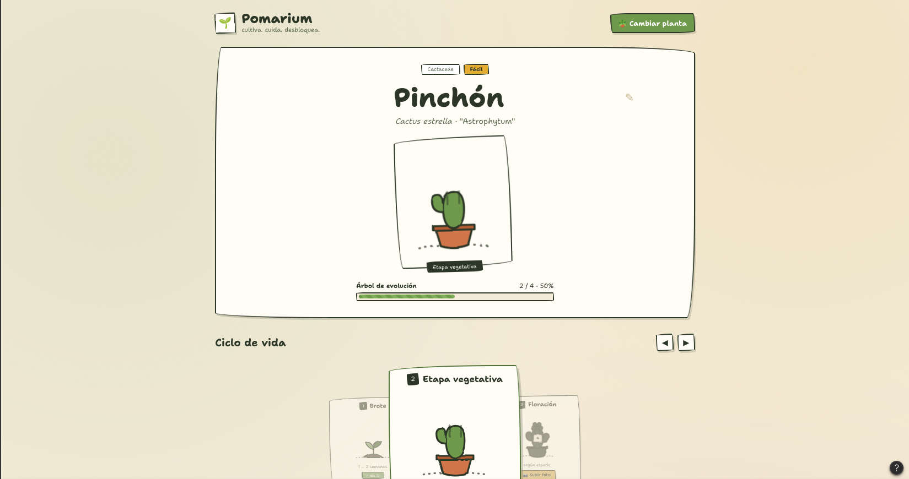

*Design made in Figma*

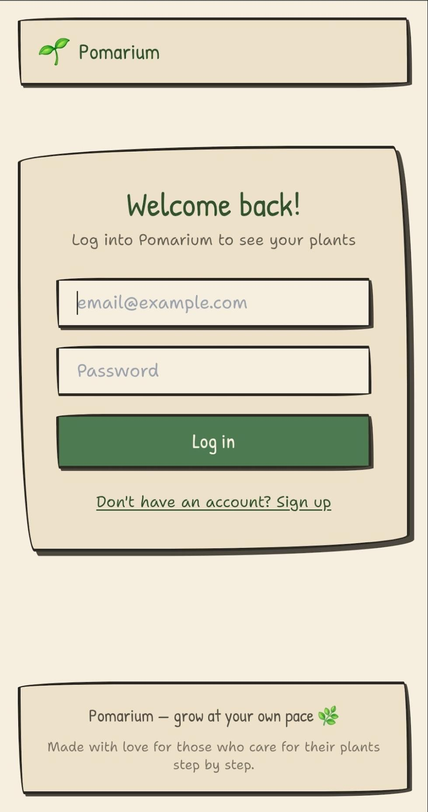

*Login*

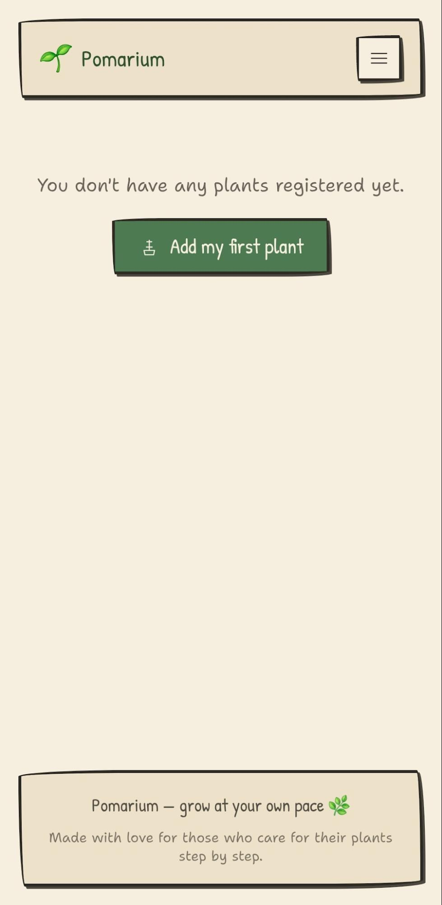

*Plant collection*

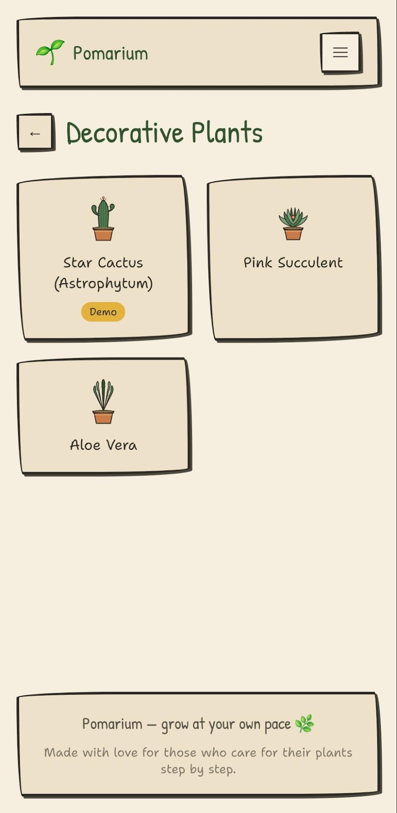

*Plant type selection*

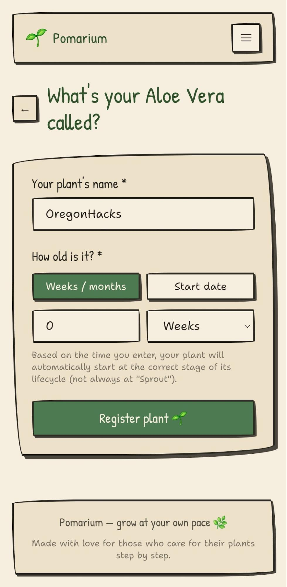

*New plant form*

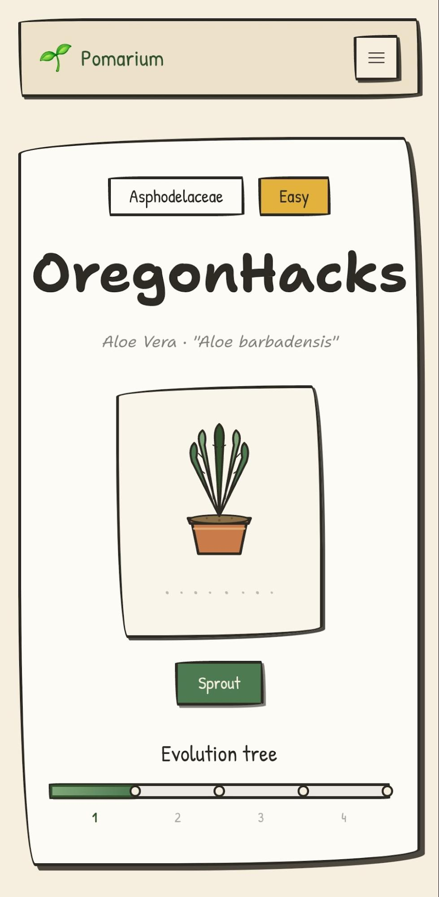

*Plant visualization*

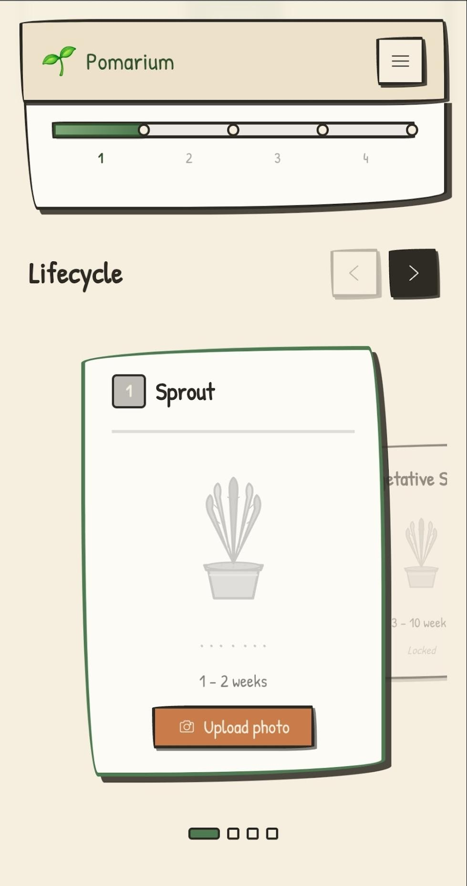

*Plant life cycle*

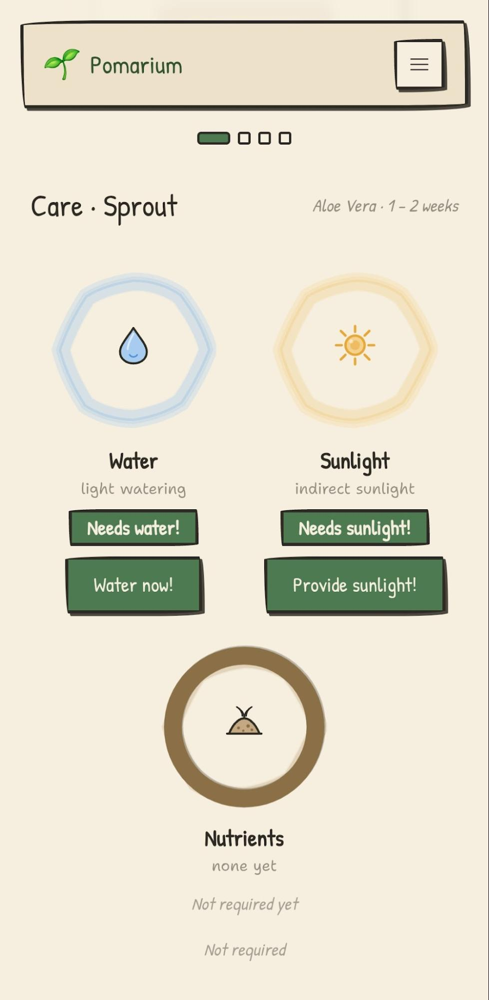

*Plant care*

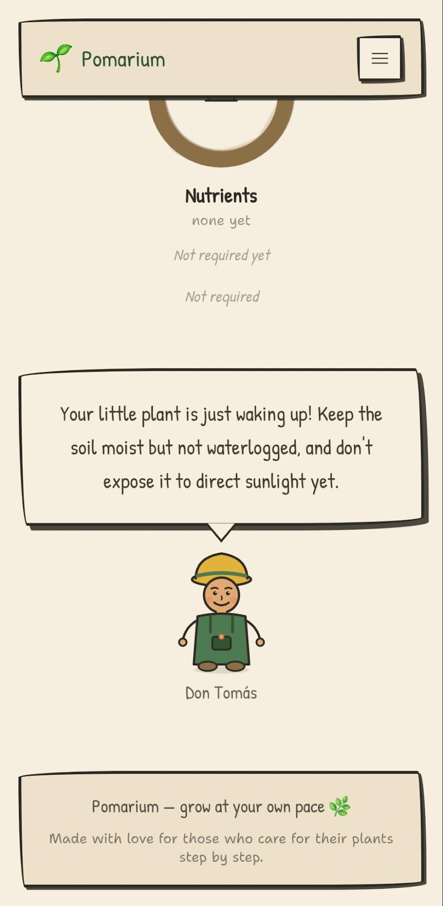

*Care tips*

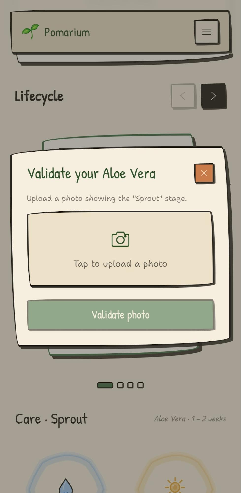

*Photo upload screen*

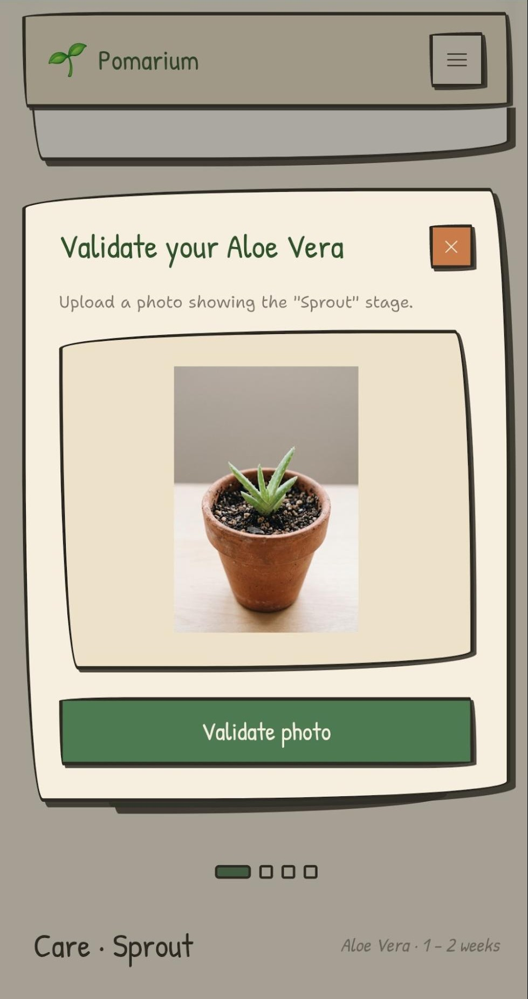

*AI photo validation*

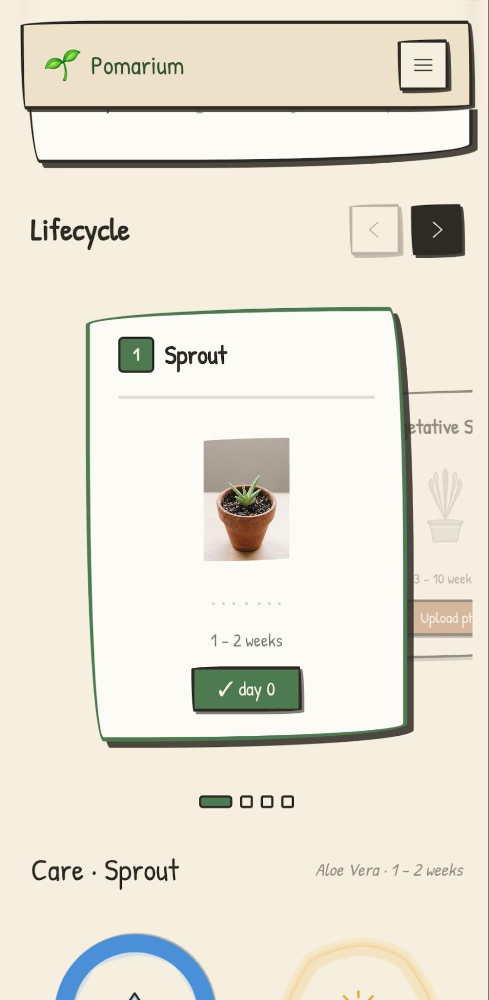

*Life stage documentation*

---

## Functionalities

- **Plant registration:** the user chooses the plant they acquired to track, selecting whether to start from a seed or another age.
- **Growth tracking:** growth is represented through stages such as sprout (1-2 weeks), vegetative stage, flowering, and fruiting.
- **Evidence logging:** each stage unlocks when the user takes a photo of their plant showing its growth, thereby recording their progress.
- **Care recommendations:** at each stage, specific recommendations are shown for that plant: amount of water, sunlight, nutrients, among others.

---

## Technologies Used

| Technology | Component |
|---|---|
| React | Frontend |
| Express | Backend |
| Firebase | Database |
| Gemini API | Image recognition |
| Render | Hosting platform |

## Use of Artificial Intelligence

During the development of Pomarium, several AI tools were used: Figma for initial sketches of the website, Claude for backend and frontend development, and Gemini to create the plant images shown in the web app. AI was also used to present the data for each plant in this presentation.

---

## Project Link

[Pomarium Website Link](https://pomarium.onrender.com)

---

## Team

- **Quispe Bedregal, Joaquín Alejandro**
- **Hatches Curo, José León Enrique**
- **Camargo Choque, Romina Guiliana**
